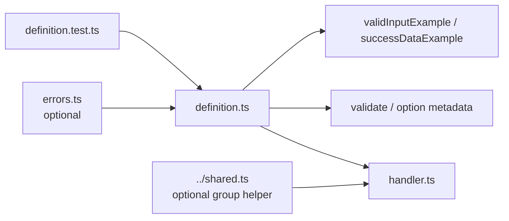

# `orfe` architecture overview

## Summary

`orfe` is a stand-alone GitHub operations runtime with two entrypoints over the same core behavior:
- a CLI named `orfe`
- an OpenCode plugin that registers the `orfe` tool

The design goal is to provide deterministic, reusable GitHub operations without embedding repository-specific workflow policy into the runtime itself.

The architecture is evolving toward a layered model of **core plus installable extensions**.
Core remains the shared runtime substrate.
Extensions are separately installed deterministic opinion layers that repositories may enable declaratively.

The current command architecture uses explicit vertical command slices under `src/commands/`. Each command owns its own metadata, validation, handler wiring, and co-located tests. A generic registry composes those slices into a single command catalog used by both the CLI and the core.

## Major runtime parts

### 1. OpenCode plugin entrypoint
Represented by `src/plugin.ts`, exported from the package at `./plugin`, and consumed by repositories through the `opencode.json` `plugin` array.

Responsibilities:
- expose the `orfe` tool through `OrfePlugin`
- read `context.agent`
- resolve a plain `callerName`
- pass only plain data into the runtime core

It must not:
- call GitHub directly for command behavior
- pass raw OpenCode runtime objects into the core

### 2. CLI entrypoint
Represented by `src/cli.ts` and `src/command.ts`.

Responsibilities:
- support commandless invocation as a help/noop path
- parse CLI arguments generically from registered command metadata
- resolve caller identity for direct CLI usage
- invoke the same runtime core used by the plugin entrypoint
- print structured JSON success or structured errors

The CLI is intentionally a thin adapter. It renders root, group, and leaf help from the registered command catalog rather than maintaining a separate hardcoded command map.

### 3. Core runtime
Represented by `src/core.ts` plus the command catalog under `src/commands/`.

Responsibilities:
- load repo-local config
- resolve caller-to-bot mapping
- load machine-local auth config
- build GitHub clients
- look up a command definition through the generic registry in `src/commands/registry/index.ts`
- validate input against slice-owned option definitions and validators
- dispatch to the slice-owned handler referenced by the registered definition
- return structured success or typed errors

The core is runtime-agnostic and must remain callable from both CLI and plugin entrypoints.
It is also the future extension host, but it must preserve the same wrapper/core and plain-data boundaries while doing so.

### 4. Config layer
Current examples include `src/config.ts` and `.orfe/config.json`.

Responsibilities:
- hold repo-local non-secret configuration
- map caller names to GitHub bots
- define repository and project defaults
- declare which installed extensions are enabled for this repository
- hold per-extension declarative `config` when extensions are enabled
- stay separate from repo-defined body-contract artifacts under `.orfe/contracts/`

Repo config is declarative and non-secret.
It may enable or configure extensions, but it must not ship executable extension code.

### 5. Body-contract layer
Current examples include `src/body-contracts.ts`, `src/commands/body-contract-shared.ts`, and `.orfe/contracts/`.

Responsibilities:
- load versioned declarative issue and PR body contracts from the repository
- validate or minimally normalize issue and PR bodies deterministically
- append and read HTML comment provenance markers
- stay below repository workflow policy rather than interpreting ownership or orchestration semantics

### 6. Auth layer
Current examples include `src/github.ts` and machine-local auth config.

Responsibilities:
- load machine-local per-bot GitHub App credentials
- mint installation tokens
- keep secret-bearing auth details outside repo-local config

### 7. GitHub adapter layer
Current examples include the slice handlers under `src/commands/**/handler.ts` and the shared GitHub client factory in `src/github.ts`.

Responsibilities:
- use Octokit REST where appropriate for issue and PR behavior
- use GraphQL where required for project status and duplicate semantics
- preserve deterministic command behavior and structured outputs

### 8. Extension layer
This is an architecture direction established before implementation.

Responsibilities:
- provide installable namespaced command families above core
- hold reusable deterministic opinionated mechanics that do not belong in the generic core
- declare compatibility with the running core version
- remain inactive for a repository unless explicitly enabled in `.orfe/config.json`

Extensions are installed into the runtime environment, not provided as executable code by the repository.
Installed does not mean enabled.
Enabled does not mean validly configured.

## Module map

```mermaid
graph TD
  Plugin[OpenCode plugin<br/>src/plugin.ts] --> Core[Core runtime<br/>src/core.ts]
  CLI[CLI entrypoint<br/>src/cli.ts + src/command.ts] --> Core

  Core --> Config[Repo config<br/>src/config.ts]
  Core --> BodyContracts[Body contracts<br/>src/body-contracts.ts]
  Core --> Auth[Caller bot + auth config]
  Core --> GitHub[GitHub client factory<br/>src/github.ts]
  Core --> Registry[Generic command registry<br/>src/commands/registry/index.ts]
  Core --> Extensions[Installed extensions<br/>optional + namespaced]

  Registry --> Commands[Registered commands<br/>src/commands/index.ts]

  Commands --> AuthGroup[auth]
  Commands --> IssueGroup[issue]
  Commands --> PrGroup[pr]
  Commands --> ProjectGroup[project]

  AuthGroup --> AuthToken[token]
  AuthToken --> AuthTokenDef[definition.ts]
  AuthToken --> AuthTokenHandler[handler.ts]

  IssueGroup --> IssueShared[shared.ts]
  IssueGroup --> IssueGet[get]
  IssueGroup --> IssueCreate[create]
  IssueGroup --> IssueComment[comment]
  IssueGroup --> IssueUpdate[update]
  IssueGroup --> IssueSetState[set-state]
  IssueGet --> IssueGetParts[definition.ts + handler.ts]
  IssueCreate --> IssueCreateParts[definition.ts + handler.ts]
  IssueComment --> IssueCommentParts[definition.ts + handler.ts]
  IssueUpdate --> IssueUpdateParts[definition.ts + handler.ts + errors.ts]
  IssueSetState --> IssueSetStateParts[definition.ts + handler.ts + errors.ts]

  PrGroup --> PrShared[shared.ts]
  PrGroup --> PrGet[get]
  PrGroup --> PrGetOrCreate[get-or-create]
  PrGroup --> PrComment[comment]
  PrGroup --> PrReply[reply]
  PrGroup --> PrSubmitReview[submit-review]
  PrGet --> PrGetParts[definition.ts + handler.ts]
  PrGetOrCreate --> PrGetOrCreateParts[definition.ts + handler.ts]
  PrComment --> PrCommentParts[definition.ts + handler.ts]
  PrReply --> PrReplyParts[definition.ts + handler.ts]
  PrSubmitReview --> PrSubmitReviewParts[definition.ts + handler.ts + errors.ts]

  ProjectGroup --> ProjectShared[shared.ts]
  ProjectGroup --> ProjectGetStatus[get-status]
  ProjectGroup --> ProjectSetStatus[set-status]
  ProjectGetStatus --> ProjectGetStatusParts[definition.ts + handler.ts]
  ProjectSetStatus --> ProjectSetStatusParts[definition.ts + handler.ts]
```



## Command slice structure

Command behavior is organized as explicit vertical slices under `src/commands/`.
The registry is generic composition infrastructure; command semantics live with the slices themselves.

Canonical layout:

```text
src/commands/
  index.ts
  registry/
    types.ts
    definition.ts
    common-options.ts
    index.ts
  <group>/
    shared.ts                # only when multiple commands in the group reuse helper logic
    <command>/
      definition.ts          # command metadata, examples, options, validation, handler reference
      handler.ts             # implementation
      errors.ts              # optional command-local validation/business-rule helpers
      definition.test.ts     # slice-local definition/validation tests
```

Per-slice relationship:



Each `definition.ts` is the slice-owned contract. It defines the canonical command name, purpose, usage, examples, options, valid input example, success data example, optional validation hook, and the handler to execute. `src/commands/index.ts` explicitly registers those definitions in the `COMMANDS` array, and `src/commands/registry/index.ts` provides generic lookup, listing, grouping, and option validation over that array.

Group-local `shared.ts` files exist only when multiple commands in the same group reuse normalization, response mapping, or GitHub lookup helpers. They are intentionally scoped helpers, not replacements for the slice structure.

To add a new command:
- create a new directory at `src/commands/<group>/<command>/`
- implement `definition.ts` and `handler.ts`
- add `errors.ts` only if the command has local validation or business-rule helpers
- add a co-located `definition.test.ts`
- register the slice in `src/commands/index.ts`
- use or extend `<group>/shared.ts` only for helper logic genuinely shared by multiple commands in that group

Command-specific tests live beside the slice by default. Cross-cutting CLI, core, wrapper, plugin, and package-level tests remain in `test/`.

## Architectural rules to keep in mind

- plugin entrypoint reads OpenCode context; core does not
- core accepts plain data only
- repo-local config contains no secrets
- repo-local config may enable extensions declaratively but cannot ship executable extension code
- repo-defined body contracts live beside config under `.orfe/contracts/`, not inside config
- machine-local auth config contains bot credentials
- command registry stays generic and deterministic
- command semantics live in slice definitions and handlers, not in duplicate metadata files
- command behavior uses Octokit, not `gh` shell-outs
- body contracts stay declarative and do not encode repository workflow orchestration
- repo workflow policy belongs above `orfe`, not inside it
- installed extensions are not active unless the repository enables them explicitly
- per-extension repo settings use `config` terminology unless a future ADR changes that contract

These file references are descriptive of the current layout, not a promise that file organization will never change.
When files move, update this overview if the conceptual boundaries also need clarification.

## Related docs

- `docs/architecture/invariants.md`
- `docs/architecture/auth-model.md`
- `docs/architecture/adrs/`
- `docs/orfe/spec.md`
