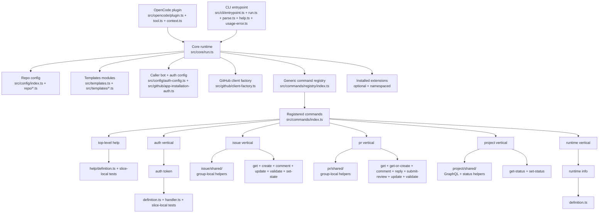
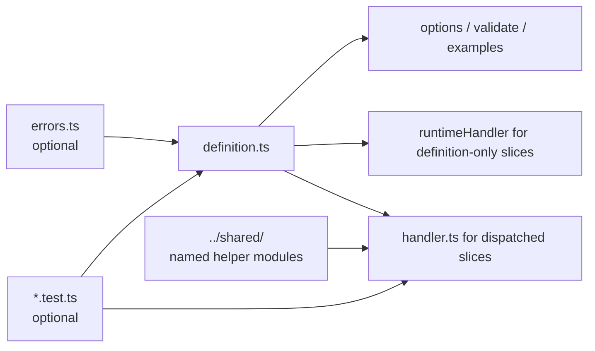

# `orfe` architecture overview

## Summary

`orfe` is a stand-alone GitHub operations runtime with two entrypoints over the same core behavior:
- a CLI named `orfe`
- an OpenCode plugin that registers the `orfe` tool

The design goal is to provide deterministic, reusable GitHub operations without embedding repository-specific workflow policy into the runtime itself.

The architecture is evolving toward a layered model of **core plus installable extensions**.
Core remains the shared runtime substrate.
Extensions are separately installed deterministic opinion layers that repositories may enable declaratively.

The repository is organized as a **feature-oriented vertical slice architecture** flavored by **Unix philosophy**: small, responsibility-named modules composed through explicit boundaries.
The built-in command catalog currently lives under `src/commands/` as grouped verticals for `auth`, `issue`, `pr`, `project`, and `runtime`, plus the top-level `help` command. Slices such as `issue validate`, `issue update`, `pr validate`, `pr update`, `project set-status`, and `runtime info` are first-class peers of the older get/create/comment paths.

The current command architecture uses explicit vertical command slices under `src/commands/`. Each command owns its own metadata, validation, handler wiring, and co-located tests. A generic registry composes those slices into a single command catalog used by both the CLI and the core.

## Feature verticals, command slices, and cross-cutting concerns

`orfe` distinguishes between a **feature vertical** and a **command slice**:

- a feature vertical is a domain-owned command group such as `auth`, `issue`, `pr`, `project`, or `runtime`
- a command slice is one executable command within that vertical, such as `issue create` or `project set-status`
- some built-in commands are top-level rather than vertical-owned, such as `help`

Each vertical should remain understandable and refactorable on its own. Command slices inside that vertical own their contracts, handlers, and slice-local tests, while group-local shared helpers remain subordinate to the vertical rather than becoming alternate owners of behavior.

Cross-cutting concerns such as config loading, template handling, CLI formatting, filesystem helpers, auth token minting, and GitHub client construction exist to support slices through narrow interfaces. They should be named by responsibility and kept small enough that they do not turn into replacement dumping grounds.

When choosing between incidental deduplication and ownership clarity, prefer **slice autonomy**. Small duplication across slices is acceptable when it preserves encapsulation, keeps feature ownership obvious, and makes a slice easier to change or remove independently.

## Current built-in command surface

The current built-in command catalog is small enough to describe conceptually without turning this overview into a generated inventory:

- top-level discovery: `help`
- auth bootstrap: `auth token`
- issue lifecycle: `issue get`, `issue create`, `issue comment`, `issue update`, `issue validate`, `issue set-state`
- pull request lifecycle: `pr get`, `pr get-or-create`, `pr comment`, `pr reply`, `pr submit-review`, `pr update`, `pr validate`
- project tracking: `project get-status`, `project set-status`
- runtime inspection: `runtime info`

This overview should stay aligned with those command families and ownership boundaries, but it should not try to mirror every internal file one-for-one.

## Major runtime parts

### 1. OpenCode plugin entrypoint
Represented by `src/opencode/plugin.ts`, with OpenCode-specific caller resolution in `src/opencode/context.ts` and tool execution in `src/opencode/tool.ts`, exported from the package at `./plugin`, and consumed by repositories through the `opencode.json` `plugin` array.

Responsibilities:
- expose the `orfe` tool through `OrfePlugin`
- read `context.agent`
- resolve a plain `callerName`
- pass only plain data into the runtime core

It must not:
- call GitHub directly for command behavior
- pass raw OpenCode runtime objects into the core

### 2. CLI entrypoint
Represented by `src/cli/entrypoint.ts`, `src/cli/run.ts`, `src/cli/parse.ts`, `src/cli/help.ts`, and `src/cli/types.ts`.

Responsibilities:
- support commandless invocation as a help/noop path
- parse CLI arguments generically from registered command metadata
- resolve caller identity for direct CLI usage
- invoke the same runtime core used by the plugin entrypoint
- print structured JSON success or structured errors

The CLI is intentionally a thin adapter. It renders root, group, and leaf help from the registered command catalog rather than maintaining a separate hardcoded command map.

### 3. Core runtime
Represented by `src/core/run.ts`, `src/core/context.ts`, `src/core/types.ts`, plus the command catalog under `src/commands/`.

Responsibilities:
- load repo-local config
- resolve caller-to-bot mapping
- load machine-local auth config
- build GitHub clients
- look up a command definition through the generic registry in `src/commands/registry/index.ts`
- validate input against slice-owned option definitions and validators
- execute the slice-owned runtime path referenced by the registered definition, whether that is a dispatched handler or a definition-owned runtime handler
- return structured success or typed errors

The core is runtime-agnostic and must remain callable from both CLI and plugin entrypoints.
It is also the future extension host, but it must preserve the same OpenCode tool/core and plain-data boundaries while doing so.

### 4. Config layer
Current examples include `src/config/index.ts`, `src/config/types.ts`, `src/config/schema.ts`, `src/config/json-file.ts`, `src/config/config-paths.ts`, `src/config/repo/config.ts`, `src/config/repo/ref.ts`, `src/config/auth-config.ts`, `src/config/project-defaults.ts`, and `.orfe/config.json`.

Responsibilities:
- hold repo-local non-secret configuration
- map caller names to GitHub bots
- define repository and project defaults
- declare which installed extensions are enabled for this repository
- hold per-extension declarative `config` when extensions are enabled
- stay separate from repo-defined template artifacts under `.orfe/templates/`

Repo config is declarative and non-secret.
It may enable or configure extensions, but it must not ship executable extension code.
The config layer should be composed from narrow modules by responsibility, not a catch-all `shared.ts`.

### 5. Template layer
Current examples include `src/templates.ts`, `src/templates/body-input.ts`, `src/templates/prepare.ts`, `src/templates/loader.ts`, and `.orfe/templates/`.

Responsibilities:
- load versioned declarative issue and PR templates from the repository
- validate or minimally normalize issue and PR bodies deterministically
- append and read HTML comment provenance markers
- prepare command-shared issue/PR body input without placing template concerns under command ownership
- stay below repository workflow policy rather than interpreting ownership or orchestration semantics

### 6. Auth layer
Current examples include `src/github/app-installation-auth.ts`, `src/github/jwt.ts`, and machine-local auth config.

Responsibilities:
- load machine-local per-bot GitHub App credentials
- mint installation tokens
- keep secret-bearing auth details outside repo-local config

### 7. GitHub adapter layer
Current examples include the slice handlers under `src/commands/**/handler.ts` and the shared GitHub client factory in `src/github/client-factory.ts`.

Responsibilities:
- use Octokit REST where appropriate for issue and PR behavior
- use GraphQL where required for project status and duplicate semantics
- preserve deterministic command behavior and structured outputs

### 8. Extension layer
This is an architecture direction established before implementation.

Responsibilities:
- provide installable namespaced command families above core
- hold reusable deterministic opinionated mechanics that do not belong in the generic core
- declare compatibility with the running core version
- remain inactive for a repository unless explicitly enabled in `.orfe/config.json`

Extensions are installed into the runtime environment, not provided as executable code by the repository.
Installed does not mean enabled.
Enabled does not mean validly configured.

## Module map



## Command slice structure

Command behavior is organized as explicit vertical slices under `src/commands/`.
The registry is generic composition infrastructure; command semantics live with the slices themselves.
The vertical is the primary semantic owner; the individual command slice is the executable unit inside that vertical.

Representative layout:

```text
src/commands/
  index.ts
  registry/
    types.ts
    definition.ts
    common-options.ts
    index.ts
  help/
    definition.ts          # top-level runtime-owned command
    *.test.ts              # slice-local tests when present
  runtime/
    info/
      definition.ts        # runtime-only slice handled directly from the definition
  <group>/
    shared/
      <named-module>.ts      # optional group-local helpers named by responsibility
    <command>/
      definition.ts          # command metadata, examples, options, validation, handler reference
      handler.ts             # implementation for dispatched command slices
      errors.ts              # optional command-local validation/business-rule helpers
      output.ts              # command-local public success DTO when the command returns structured data
      *.test.ts              # slice-local tests such as cli/core/tool/definition coverage
```

Per-slice relationship:



Each `definition.ts` is the slice-owned contract. It defines the canonical command name, purpose, usage, examples, options, valid input example, success data example, and either the dispatched handler or the runtime-owned execution path for that command. `src/commands/index.ts` explicitly registers those definitions in the `COMMANDS` array, including grouped commands plus the top-level `help` command, and `src/commands/registry/index.ts` provides generic lookup, listing, grouping, and option validation over that array.

When multiple commands in one group reuse logic, place it under `<group>/shared/` using responsibility-named modules such as `github-response.ts`, `github-errors.ts`, `lookup.ts`, or `status-field.ts`. Avoid catch-all replacements like `shared.ts`, `types.ts`, or `utils.ts`.
If logic belongs to a cross-cutting layer such as templates, config, filesystem, CLI, or auth, keep it there instead of forcing it under command ownership just because multiple commands call it.

To add a new command:
- decide whether it belongs in an existing vertical, a new vertical, or as a rare top-level command such as `help`
- create a new directory at `src/commands/<group>/<command>/`
- implement `definition.ts`, and add `handler.ts` when the command is dispatched rather than definition-only
- add `errors.ts` only if the command has local validation or business-rule helpers
- add co-located `*.test.ts` coverage appropriate to the slice
- register the slice in `src/commands/index.ts`
- use or extend `<group>/shared/` only for helper logic genuinely shared by multiple commands in that group, and name modules by responsibility

Command-specific tests live beside the slice by default when they exercise only that slice's local contract surface, such as `definition.test.ts` and focused runtime-surface tests like `core.test.ts`, `tool.test.ts`, or `cli.test.ts`. Cross-cutting CLI, core, OpenCode tool/plugin, template-runtime, shared mock, and package-level tests remain in `test/`, and test-only support artifacts such as GitHub mocks must not live under `src/`.

## Architectural rules to keep in mind

- plugin entrypoint reads OpenCode context; core does not
- core accepts plain data only
- repo-local config contains no secrets
- repo-local config may enable extensions declaratively but cannot ship executable extension code
- repo-defined templates live beside config under `.orfe/templates/`, not inside config
- machine-local auth config contains bot credentials
- command registry stays generic and deterministic
- command semantics live in slice definitions and handlers, not in duplicate metadata files
- command behavior uses Octokit, not `gh` shell-outs
- templates stay declarative and do not encode repository workflow orchestration
- repo workflow policy belongs above `orfe`, not inside it
- installed extensions are not active unless the repository enables them explicitly
- per-extension repo settings use `config` terminology unless a future ADR changes that contract

These file references are descriptive of the current layout, not a promise that file organization will never change.
When files move, update this overview if the conceptual boundaries also need clarification.

## Related docs

- `docs/architecture/invariants.md`
- `docs/architecture/auth-model.md`
- `docs/architecture/adrs/`
- `docs/orfe/spec.md`
